# System Architecture

Comprehensive architecture documentation for Server 1586 - Last War alliance management and NAP15 system.

## Table of Contents

- [System Overview](#system-overview)
- [Technology Stack](#technology-stack)
- [Architecture Layers](#architecture-layers)
- [Frontend Architecture](#frontend-architecture)
- [Admin Panel Architecture](#admin-panel-architecture)
- [Data Layer](#data-layer)
- [Security Architecture](#security-architecture)
- [API Architecture](#api-architecture)
- [Authentication & Authorization](#authentication--authorization)
- [Notification System](#notification-system)
- [Discord Integration](#discord-integration)
- [Deployment Architecture](#deployment-architecture)

---

## System Overview

Server 1586 is a hybrid static/dynamic web application for managing Last War alliances, NAP15 agreements, and council governance.

### High-Level Architecture

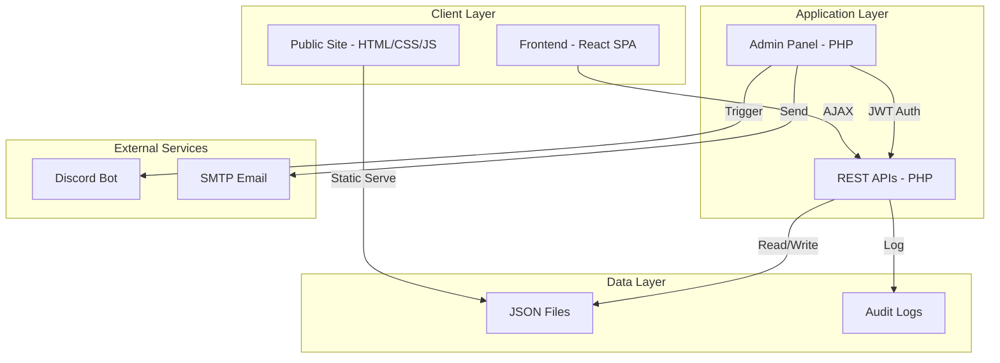

### System Context

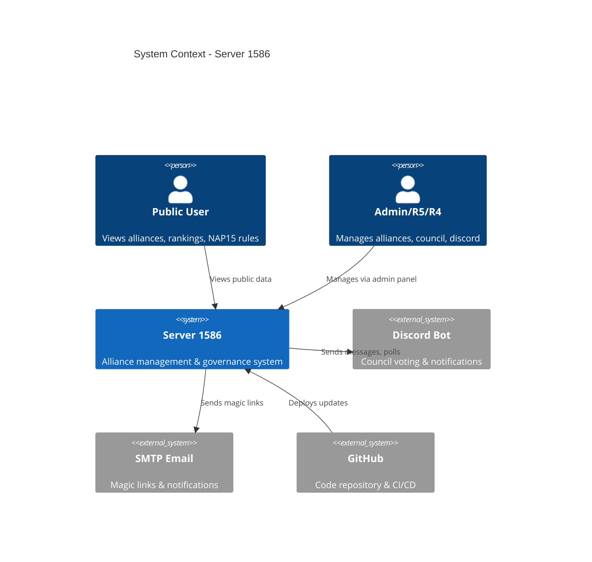

---

## Technology Stack

### Frontend (Public Site)
- **Framework:** React 18 + TypeScript
- **Build Tool:** Vite 5
- **UI Library:** HeroUI v3 (React Aria Components)
- **Styling:** Tailwind CSS v4
- **Charts:** Chart.js + react-chartjs-2
- **State:** React Hooks (useState, useEffect)
- **Routing:** React Router (client-side)

### Admin Panel (Backend)
- **Language:** PHP 8.1+
- **Authentication:** JWT (JSON Web Tokens)
- **Email:** PHPMailer 6.9
- **Session:** JWT-based (no server-side sessions)
- **Validation:** Custom input validation
- **Security:** CSRF tokens, CSP headers, rate limiting

### Data Storage
- **Primary:** JSON files
- **Audit Logs:** JSON append-only log
- **Backups:** Automated JSON snapshots
- **Future:** Planned migration to PostgreSQL

### Infrastructure
- **Web Server:** Apache/Nginx + PHP-FPM
- **Deployment:** GitHub Actions (CI/CD)
- **Hosting:** Self-hosted / Cloud VPS
- **CDN:** Potential CloudFlare integration

### Development Tools
- **Version Control:** Git + GitHub
- **Testing:** PHPUnit
- **Linting:** PHPStan (static analysis)
- **AI Assist:** LM Studio (local inference)
- **Documentation:** Markdown + Mermaid diagrams

---

## Architecture Layers

### 1. Presentation Layer
- **Public Frontend:** React SPA for rankings, charts, rules
- **Admin Dashboard:** PHP-rendered pages with AJAX

### 2. Application Layer
- **Business Logic:** PHP classes and functions
- **API Endpoints:** RESTful JSON APIs
- **Authentication:** JWT token validation
- **Authorization:** Role-based access control

### 3. Data Layer
- **Storage:** JSON files in `data/` directory
- **Caching:** In-memory (PHP opcache)
- **Audit:** Append-only log files

### 4. Integration Layer
- **Discord Bot:** External Node.js bot (separate repo)
- **Email Service:** SMTP via PHPMailer
- **GitHub:** CI/CD webhooks

---

## Frontend Architecture

### React Application Structure

```
client/
├── src/
│   ├── components/         # Reusable UI components
│   │   ├── AllianceGrid.tsx
│   │   ├── PowerTrendsEnhanced.tsx
│   │   ├── FullscreenButton.tsx
│   │   └── ...
│   ├── hooks/             # Custom React hooks
│   │   ├── useApi.ts      # Data fetching
│   │   ├── useFullscreen.ts
│   │   └── ...
│   ├── types/             # TypeScript types
│   ├── HomePage.tsx       # Main page component
│   └── main.tsx           # Entry point
├── public/
│   ├── data/              # Static JSON data
│   ├── images/            # Alliance logos
│   └── index.html
└── dist/                  # Build output
```

### Data Flow (Frontend)

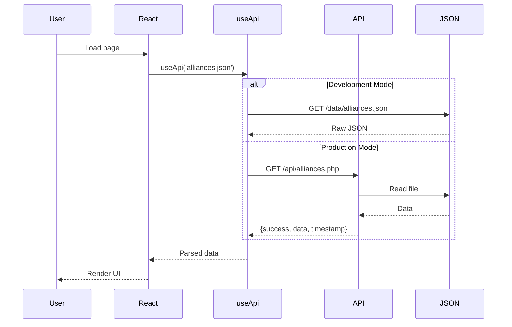

### Component Hierarchy

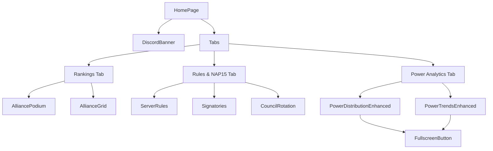

---

## Admin Panel Architecture

### Directory Structure

```
admin/
├── includes/              # Shared utilities
│   ├── jwt.php           # JWT authentication
│   ├── csrf.php          # CSRF protection
│   ├── csp.php           # Content Security Policy
│   ├── input_validator.php
│   ├── audit_log.php
│   └── header.php        # Shared header/nav
├── api/                  # REST API endpoints
│   ├── notifications_api.php
│   ├── alliances_power_api.php
│   └── ...
├── *.php                 # Admin pages
└── tests/               # PHPUnit tests
```

### Request Lifecycle

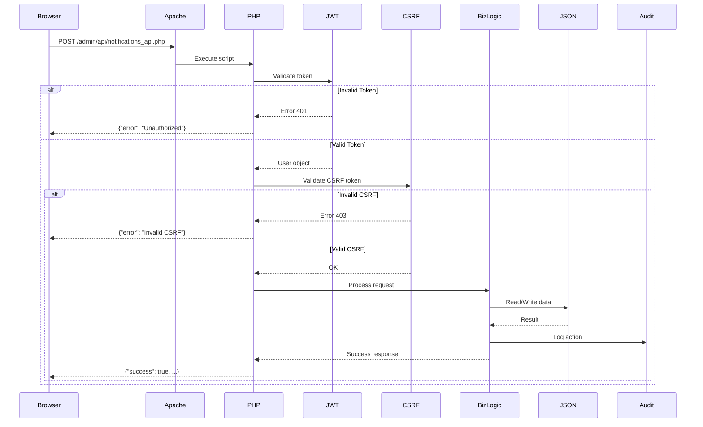

### Page Architecture

All admin pages follow this pattern:

```php
<?php
// 1. Start session and validate JWT
require_once 'includes/jwt.php';
$user = require_jwt_session();

// 2. Check permissions
if (!has_role($user, ['admin', 'r5'])) {
    http_response_code(403);
    exit('Access denied');
}

// 3. Include shared header (CSP, CSRF, nav)
$page_title = 'Dashboard';
require_once 'includes/header.php';

// 4. Page-specific logic
// ...

// 5. Include shared footer
require_once 'includes/footer.php';
?>
```

---

## Data Layer

### JSON File Storage

```
data/
├── alliances.json          # Alliance data & rankings
├── power-history.csv       # Historical power data
├── users.json              # User accounts (admin only)
├── server-info.json        # Server metadata
├── rotation-schedule.json  # Council rotation
├── notifications.json      # Notification system
├── discord-votes.json      # Vote data
├── audit-log.json         # Security audit trail
└── backups/               # Automated backups
    └── YYYYMMDD-HHMMSS/
```

### Data Schema Examples

**alliances.json:**
```json
{
  "version": "3.7.0",
  "last_updated": "2025-11-12T12:00:00Z",
  "alliances": [
    {
      "rank": 1,
      "tag": "FNXS",
      "name": "Phoenix Rising",
      "leader": "CommanderX",
      "power": 125000000,
      "members": 100,
      "logo": "/images/alliances/fnxs.png",
      "nap15_signatory": true
    }
  ]
}
```

**notifications.json:**
```json
{
  "version": "1.0.0",
  "notifications": [
    {
      "id": "notif_abc123_1699800000",
      "type": "amendment_vote",
      "priority": "high",
      "title": "Vote Required",
      "message": "Amendment v1.3 needs approval",
      "recipient_type": "role",
      "recipients": ["admin", "president"],
      "action_url": "votes.php?id=123",
      "created_at": "2025-11-12 10:00:00",
      "expires_at": "2025-11-13 10:00:00",
      "read_by": ["user@example.com"]
    }
  ]
}
```

### Data Validation Pipeline

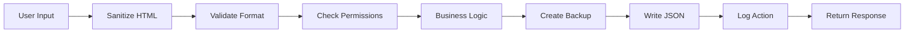

### File Operations

All file operations use atomic writes:

```php
// Read with error handling
function read_json_file($path) {
    if (!file_exists($path)) {
        return ['version' => '1.0.0', 'data' => []];
    }
    $content = file_get_contents($path);
    return json_decode($content, true);
}

// Atomic write (write to temp, then rename)
function write_json_file($path, $data) {
    $temp = $path . '.tmp';
    file_put_contents($temp, json_encode($data, JSON_PRETTY_PRINT));
    rename($temp, $path);  // Atomic on Unix
}
```

---

## Security Architecture

### Multi-Layer Security

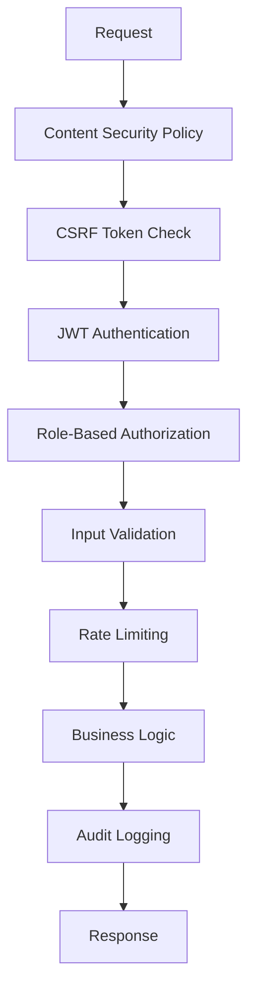

### 1. Content Security Policy (CSP)

**Location:** `admin/includes/csp.php`

**Policy:**
- `default-src 'self'` - Only same-origin
- `script-src 'self' 'nonce-xxx'` - Scripts with nonce
- `frame-ancestors 'none'` - No embedding
- `object-src 'none'` - No plugins
- `upgrade-insecure-requests` - Force HTTPS

**Implementation:**
```php
// Generate cryptographic nonce
$nonce = base64_encode(random_bytes(16));

// Send CSP header
header("Content-Security-Policy: script-src 'self' 'nonce-{$nonce}'");

// Use in HTML
<script nonce="<?php echo $nonce; ?>">
  // Approved inline script
</script>
```

### 2. CSRF Protection

**Location:** `admin/includes/csrf.php`

**Flow:**
```mermaid
sequenceDiagram
    Browser->>Server: GET /admin/form.php
    Server->>Server: Generate CSRF token
    Server->>Browser: <input name="csrf_token" value="abc123">
    Browser->>Browser: User fills form
    Browser->>Server: POST with csrf_token
    Server->>Server: Validate token
    alt Valid Token
        Server->>Server: Process request
        Server->>Browser: Success
    else Invalid Token
        Server->>Browser: 403 Forbidden
    end
```

### 3. JWT Authentication

**Location:** `admin/includes/jwt.php`

**Token Structure:**
```json
{
  "header": {
    "alg": "HS256",
    "typ": "JWT"
  },
  "payload": {
    "email": "admin@example.com",
    "aud": "admin",
    "roles": ["admin", "ape"],
    "iat": 1699800000,
    "exp": 1699828800
  },
  "signature": "..."
}
```

**Authentication Flow:**
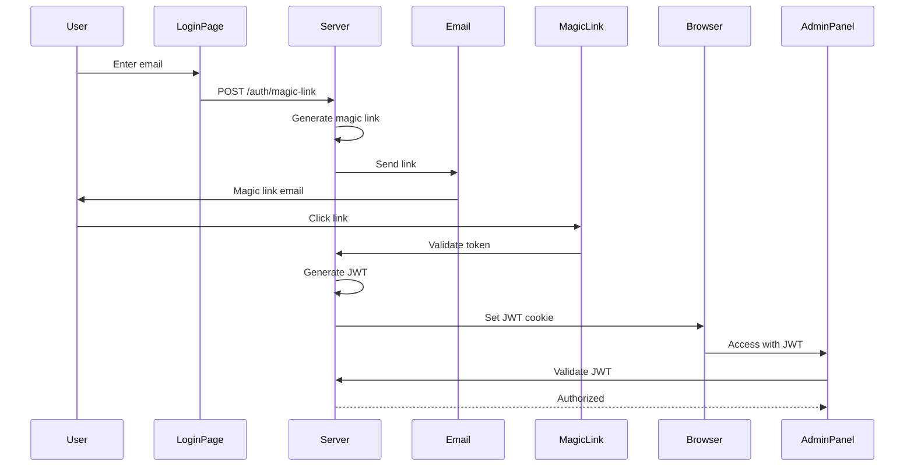

### 4. Role-Based Access Control (RBAC)

**Roles:**
- `admin` - Full system access
- `president` - Council governance + admin features
- `r5` - Alliance management
- `r4` - Limited alliance management
- `ape` - Alliance Power Editor

**Permission Check:**
```php
// Check single role
if ($user->aud !== 'admin') {
    http_response_code(403);
    exit('Access denied');
}

// Check multiple roles
if (!has_role($user, ['admin', 'president', 'r5'])) {
    http_response_code(403);
    exit('Access denied');
}
```

### 5. Input Validation

**Location:** `admin/includes/input_validator.php`

**Validation Types:**
- Email format validation
- String length limits
- Allowed character sets
- Numeric range validation
- JSON structure validation
- File upload validation

**Example:**
```php
// Validate email
if (!validate_email($email)) {
    throw new Exception('Invalid email format');
}

// Sanitize HTML
$clean = sanitize_html($user_input);

// Validate alliance tag (4 chars, alphanumeric)
if (!preg_match('/^[A-Z0-9]{4}$/', $tag)) {
    throw new Exception('Invalid alliance tag');
}
```

### 6. Rate Limiting

**Location:** `admin/includes/api_rate_limit.php`

**Limits:**
- Login attempts: 5 per 15 minutes
- API calls: 100 per minute
- Magic link generation: 3 per hour

**Implementation:**
```php
$key = "rate_limit:{$user_ip}:{$endpoint}";
$attempts = get_rate_limit($key);

if ($attempts > $limit) {
    http_response_code(429);
    exit('Rate limit exceeded');
}

increment_rate_limit($key);
```

### 7. Audit Logging

**Location:** `admin/includes/audit_log.php`

**Logged Actions:**
- Authentication (login, logout, failed attempts)
- Data modifications (create, update, delete)
- Permission changes
- Configuration updates
- API calls

**Log Format:**
```json
{
  "timestamp": "2025-11-12T10:30:45Z",
  "user": "admin@example.com",
  "action": "notification_created",
  "resource": "notif_abc123",
  "ip_address": "192.168.1.100",
  "user_agent": "Mozilla/5.0...",
  "details": {
    "notification_type": "amendment_vote",
    "recipients": ["admin", "president"]
  }
}
```

---

## API Architecture

### RESTful API Design

All APIs follow consistent patterns:

**Base URL:** `/admin/api/{resource}_api.php`

**Request:**
```
GET /admin/api/notifications_api.php?action=get_notifications&page=1
```

**Response:**
```json
{
  "success": true,
  "data": [...],
  "pagination": {
    "page": 1,
    "per_page": 10,
    "total": 50
  },
  "timestamp": "2025-11-12T10:30:45Z"
}
```

**Error Response:**
```json
{
  "success": false,
  "error": "Resource not found",
  "code": "not_found",
  "timestamp": "2025-11-12T10:30:45Z"
}
```

### API Endpoints

```mermaid
graph TB
    subgraph "Public APIs (No Auth)"
        PA[/api/alliances.php]
        PP[/api/power-history.php]
        PS[/api/server-info.php]
    end

    subgraph "Admin APIs (JWT Required)"
        NA[notifications_api.php]
        AA[alliances_power_api.php]
        UA[user_management_api.php]
        DA[discord_votes_api.php]
    end

    subgraph "Admin-Only APIs"
        SA[security_audit_api.php]
        BA[backup_restore_api.php]
    end
```

### API Authentication

**Public APIs:**
- No authentication required
- Rate limited by IP
- Return sanitized data only

**Admin APIs:**
- JWT token required in cookie
- CSRF token required for mutations
- Rate limited per user
- Audit logged

**Admin-Only APIs:**
- JWT with `aud=admin` required
- Additional permission checks
- All actions audit logged

---

## Authentication & Authorization

### JWT Token Lifecycle

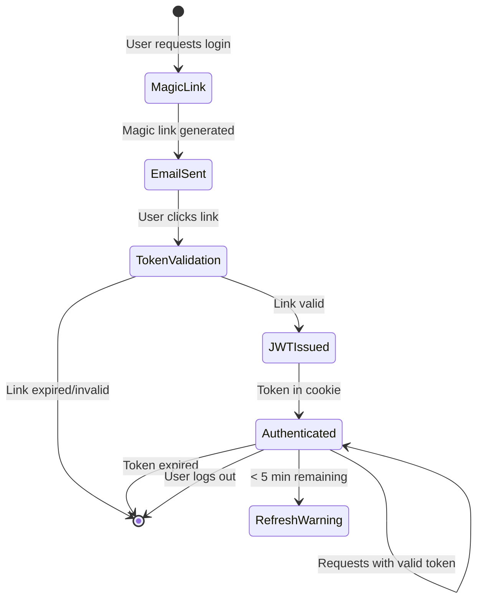

### Permission Matrix

| Role | View Dashboard | Manage Alliances | Manage Users | Council Votes | System Config |
|------|----------------|------------------|--------------|---------------|---------------|
| **admin** | ✅ | ✅ | ✅ | ✅ | ✅ |
| **president** | ✅ | ✅ | ❌ | ✅ | ❌ |
| **r5** | ✅ | ✅ | ❌ | ✅ | ❌ |
| **r4** | ✅ | Limited | ❌ | ❌ | ❌ |
| **ape** | ✅ | Power Only | ❌ | ❌ | ❌ |

---

## Notification System

### Architecture

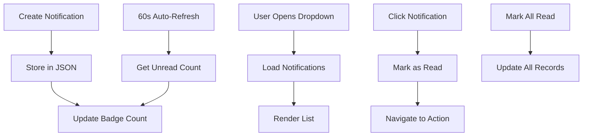

### Notification Types

1. **amendment_vote** - Rule amendment voting
2. **discord_template_approval** - Template review
3. **council_rotation** - Rotation updates
4. **vote_result** - Vote outcomes
5. **system_alert** - System notifications

### Notification Flow

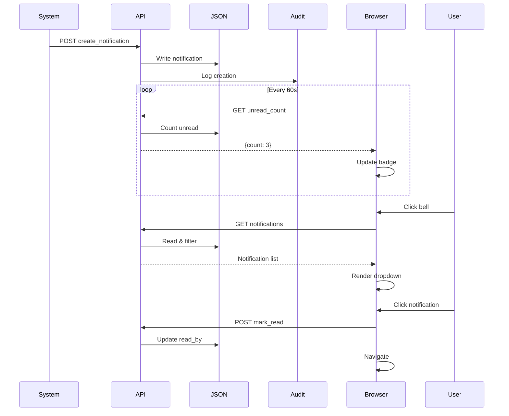

---

## Discord Integration

### Bot Communication

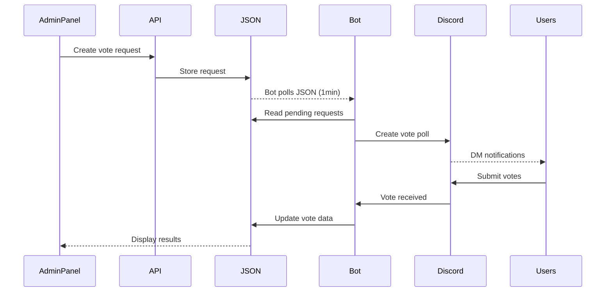

### Integration Points

1. **Vote Management:** Admin creates votes → Bot publishes to Discord
2. **Council Rotation:** Admin updates schedule → Bot announces
3. **Announcements:** Admin schedules message → Bot posts
4. **Templates:** Admin approves template → Bot uses for messages

---

## Deployment Architecture

### Development Environment

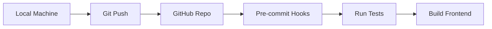

### Production Deployment

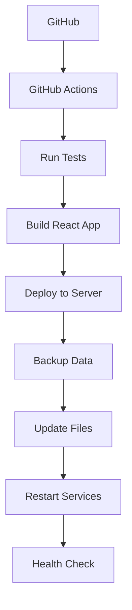

### Infrastructure

```
┌─────────────────────────────────────────┐
│           Load Balancer / CDN           │
└─────────────────┬───────────────────────┘
                  │
        ┌─────────┴──────────┐
        │                    │
┌───────▼─────────┐  ┌──────▼───────────┐
│  Web Server 1   │  │  Web Server 2    │
│  Apache + PHP   │  │  Apache + PHP    │
└────────┬────────┘  └──────┬───────────┘
         │                   │
         └──────────┬────────┘
                    │
         ┌──────────▼──────────┐
         │   Shared Storage    │
         │   (JSON Files)      │
         └─────────────────────┘
```

---

## Future Enhancements

### Planned Migrations

1. **Database Migration** (PostgreSQL)
   - Replace JSON files
   - Improve query performance
   - Better concurrent access
   - Transactional integrity

2. **Microservices Architecture**
   - Separate auth service
   - Notification service
   - Discord integration service

3. **Real-time Updates**
   - WebSocket connections
   - Live notification push
   - Real-time dashboard updates

4. **Caching Layer**
   - Redis for session data
   - Cached API responses
   - Improved performance

---

## Diagrams Legend

**Mermaid Diagram Types Used:**
- `graph` - System architecture
- `sequenceDiagram` - Request flows
- `C4Context` - System context
- `stateDiagram` - State transitions

---

## Additional Resources

- **Developer Setup:** [DEVELOPER-SETUP.md](DEVELOPER-SETUP.md)
- **API Documentation:** [API.md](API.md) *(coming soon)*
- **Deployment Guide:** [DEPLOYMENT.md](../DEPLOYMENT.md)
- **Security Policies:** [SECURITY.md](../SECURITY.md)

---

**Last Updated:** 2025-11-12
**Version:** 1.0.0
**Maintained By:** Development Team
